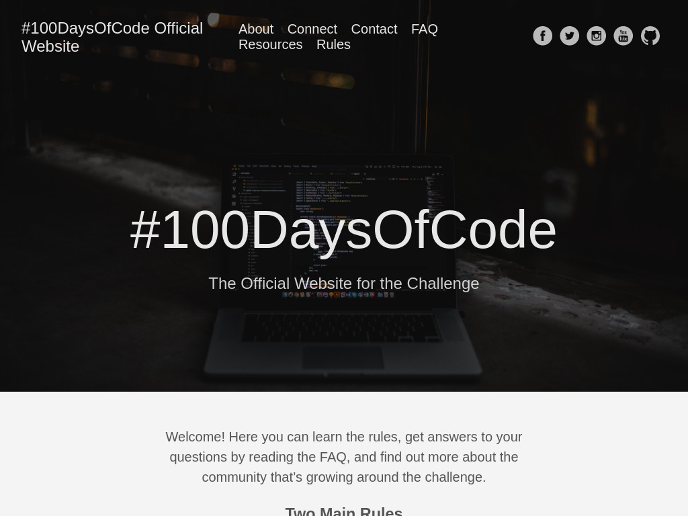

# 🔥 #100DaysOfCode Challenge

## ℹ️ Conteúdos
- [Log - visualizar progresso do Round 1](rounds/round1/log.md)
- [#100DaysOfCode Challenge official site](https://www.100daysofcode.com)
- [Proposta](#-proposta)
- [Regras](#-regras)
- [Inspiração](#-inspiração)
- [Desafio Original](https://github.com/Kallaway/100-days-of-code)

## 🎯 Proposta

Com o objetivo de criar um hábito de desenvolvimento de programas/solução de problemas, proponho-me a passar 100 dias *consecutivos criando programas dos mais diversos tipos para poder manter um crescimento e aprendizagem mais eficiente e desafiador no mundo da programação.
Este projeto surgui da necessidade/interesse em criar um ritmo de desenvolvimento prático de software para aproveitar melhor toda carga horária de conteúdo teórico que venho estudando. Além disso, é um incentivo ao aprofundamento dos conteúdos estudados e com certeza contribuirá muito para meu desenvolvimento.

*mais abaixo está descrito as minhas regras específicas para o desafio

> Visualização do site oficial do desafio #100DaysOfCode Challenge.

## 📜 Regras

**“Nós somos aquilo que fazemos repetidamente. Excelência, então, não é um modo de agir, mas um hábito.”**
 ― Aristóteles

1. Para que um dia seja validado ele deverá atender a pelo menos 1 dos requisitos abaixo:
    - [x] Resolução de algum desafio/problema em platformas de exercícios de programação (ex.: [Codewars](https://www.codewars.com/dashboard), [URI](https://www.beecrowd.com.br/judge/en/login?origem=1), [HackerRank](https://www.hackerrank.com) etc.)
    - [x] Criação de um app/aplicação web
    - [x] Implementação de funcionalidades (acrescentar novas *features* em projetos já existentes)
    - [x] Criar/continuar algum projeto -> é **PRECISO** que dê para ser postado no github de modo público (pode ser um projeto do próprio github)
1. O que foi desenvolvido na universidade/trabalho não contará como progresso para o desafio (atividades de caráter obrigatório)
1. Conceitos estudados/usados na faculdade/trabalho são válidos para utilização em projetos livres (atividades de caráter não obrigatório)
1. O progrsso será medido pelo Github, então é necessário o *push* do código desenvolvido
1. Será em (Log)[log.md] que haverá a contabilização dos dias, terá informações da atividade desenvolvida e link para visualização
1. Atividade deve ser desenvolvida antes do dia acabar (antes de dormir)
1. É permitido a falha de 1 dia, contanto que seja adicionado mais 1 dia no total de dias do desafio
1. Ao atingir 2 dias de falhas consecutivas, você perde o desafio e deverá começar um novo *round do zero

*round é entendido como "tentativas" de se finalizar o desafio e a cada vez que se deseja iniciar um novo, a contagem começara do dia 1

## 💡 Inspiração
Projeto inspirado no trabalho de [Alex Kallaway](https://github.com/kallaway)

## 📝 Licença

Esse projeto está sob licença. Veja o arquivo [LICENÇA](LICENSE) para mais detalhes.

[⬆ Voltar ao topo](#-100daysofcode-challenge)
